# Pruner-Zero: Evolving Symbolic Pruning Metric from scratch for Large Language Models
GitHub: https://github.com/pprp/Pruner-Zero
## 1. 论文总结
尽管大型语言模型（LLM）具有卓越的功能，但由于其庞大的规模，它们面临着部署挑战。修剪方法会降低权重子集以加速，但其中许多方法需要重新训练，这非常昂贵且计算量大。最近，后训练修剪方法引入了新的度量，使得LLM的修剪无需重新训练。然而，为了有效地识别上级剪枝度量，作者开发了一个使用遗传编程搜索符号剪枝度量的自动框架。特别地，还设计了一个包含现有剪枝度量的精细搜索空间来发现潜在的符号剪枝度量，并提出了一种相反的操作简化策略来增加种群的多样性，这样，基于搜索结果，本文研究了符号剪枝度量与剪枝后性能之间的关系，总结了一些原则，并在LLaMA和LLaMA-2上进行了大量的语言建模和zero-shot任务的实验，实验结果表明，我们的PrunerZero比SOTA后训练剪枝方法具有上级性能。
## 2. 论文创新点
1. **自动化的符号化剪枝度量搜索框架**
 - **首创性**：Pruner-Zero是首个利用遗传编程（Genetic Programming, GP）从零开始自动搜索符号化剪枝度量（Symbolic Pruning Metric, SPM）的框架。它通过进化算法动态生成和优化剪枝度量，无需人工设计复杂的剪枝规则。
 - **全面的搜索空间**：该框架设计了一个统一且全面的搜索空间，涵盖了现有的剪枝度量（如权重、梯度等），并引入了多种基本操作（如加法、乘法、归一化等），能够重构和优化现有的剪枝方法。
2. **对立操作简化策略（Opposing Operation Simplification, OOS）**
- **优化搜索效率**：OOS策略通过识别和消除符号树中对立的操作（如exp和log、sqrt和sqr等），减少搜索空间中的冗余，提高搜索效率和剪枝度量的多样性。
- **提升剪枝性能**：该策略不仅简化了符号表达式，还通过减少冗余操作，使得最终搜索到的剪枝度量更加简洁且性能更优。
3. **无需重新训练的高效剪枝方法**
- **无需权重更新**：Pruner-Zero在剪枝过程中无需对模型权重进行更新或重新训练，显著降低了计算成本和资源需求，尤其适用于大规模语言模型。
- **快速评估**：通过在LLaMA-2-7B模型上进行快速后剪枝评估（每次评估耗时不到5分钟），Pruner-Zero能够在短时间内找到高效的剪枝度量。
4. **广泛的实验验证和性能提升**
- **超越现有方法**：在LLaMA和LLaMA-2模型上，Pruner-Zero在多种剪枝比例（如50%、4:8、2:4）下均优于现有的剪枝方法（如SparseGPT、Wanda等），在语言建模和零样本任务中表现出更低的困惑度（Perplexity）和更高的准确率。
- **适用于多种模型架构**：Pruner-Zero不仅在LLaMA系列模型上表现出色，还成功应用于其他模型（如Tiny-LLaMA和OPT），证明了其通用性和泛化能力。
## 3. 流程图
<p align="center">




```mermaid
graph TB
    %% --- 样式定义 ---
    classDef default font-family:'Segoe UI',Arial,sans-serif,font-size:14px;
    
    %% 核心过程节点 (蓝色系)
    classDef process fill:#e3f2fd,stroke:#1565c0,stroke-width:2px,rx:8,ry:8,color:#0d47a1;
    %% 数据/对象节点 (黄色系)
    classDef data fill:#fffde7,stroke:#fbc02d,stroke-width:2px,rx:4,ry:4,color:#f57f17;
    %% 开始/结束节点 (绿色系)
    classDef start fill:#e8f5e9,stroke:#2e7d32,stroke-width:2px,rx:20,ry:20,color:#1b5e20;
    %% 评估/指标节点 (紫色系)
    classDef metric fill:#f3e5f5,stroke:#8e24aa,stroke-width:2px,stroke-dasharray: 5 5,rx:5,ry:5,color:#4a148c;
    %% 关键创新点 (红色系)
    classDef highlight fill:#ffebee,stroke:#c62828,stroke-width:3px,rx:8,ry:8,color:#b71c1c;

    %% --- 1. 初始化 ---
    Init([🚀 Initialization<br/>Symbolic Metric]):::start

    %% --- 2. 进化循环 ---
    subgraph EvoLoop [🧬 Evolutionary Search Loop]
        direction TB
        style EvoLoop fill:#fafafa,stroke:#bdbdbd,stroke-width:2px,stroke-dasharray: 5 5,color:#616161
        
        Pop[👥 Population]:::data
        Select[🏆 Selection<br/>Tournament]:::process
        Parents[👪 Parents]:::data
        Cross[🔀 Cross Over]:::process
        Mut[🧬 Mutation]:::process
        Simp[✨ Opposing Operation<br/>Simplification]:::highlight
        NewSym(📝 New Symbolic Metric):::data

        Pop --> Select
        Select --> Parents
        Parents --> Cross
        Cross --> Mut
        Mut --> Simp
        Simp --> NewSym
    end

    %% --- 3. 评估 ---
    subgraph Eval [⏱️ Post-training Evaluation < 5 mins]
        direction TB
        style Eval fill:#f9fbe7,stroke:#afb42b,stroke-width:2px,color:#827717
        
        LLM[🧠 Original LLM]:::data
        Pruned[✂️ Pruned LLM]:::data
        Calc{⚙️ Apply Metric}:::process
        Score[📊 Perplexity<br/>Wikitext2 / One-shot]:::metric

        LLM --> Calc
        Calc --> Pruned
        Pruned --> Score
    end

    %% --- 连接关系 ---
    Init ==> Pop
    NewSym ==> Calc
    Score == "Add to Population" ==> Pop

    %% 调整连线样式
    linkStyle default stroke:#546e7a,stroke-width:2px,fill:none;
```

 ## 4.公式与代码对应表

### 4.1 核心公式概览表

| 公式名称 / 描述 | 数学公式 (近似表示) | 文件名 | 行号 |
| :--- | :--- | :--- | :--- |
| **Hessian 矩阵在线更新** (SparseGPT) | $$H_{new} = \frac{n}{n+\Delta n} H_{old} + \sqrt{\frac{2}{n+\Delta n}} X X^T$$ | `lib/sparsegpt.py` | 35-38 |
| **Hessian 逆矩阵计算** (Cholesky) | $$H^{-1} = (L L^T)^{-1}$$ | `lib/sparsegpt.py` | 64-67 |
| **显著性分数 / 剪枝指标** (OBS Metric) | $$\text{metric} = \frac{w^2}{([H^{-1}]_{ii})^2}$$ | `lib/sparsegpt.py` | 84 |
| **困惑度计算** (Perplexity) | $$PPL = \exp\left(\frac{1}{N} \sum -\log P(x_i)\right)$$ | `lib/eval.py` | 75 |
| **负对数似然** (NLL) | $$\text{NLL} = \text{CrossEntropy} \times \text{SeqLen}$$ | `lib/eval.py` | 66-70 |
| **Min-Max 归一化算子** (MMS) | $$f(x) = \frac{x - \min(x)}{\max(x) - \min(x)}$$ | `lib/gptree.py` | 99 |
| **Z-Score 归一化算子** (ZSN) | $$f(x) = \frac{x - \mu}{\sigma}$$ | `lib/gptree.py` | 107 |
| **除法算子 (带归一化)** (Div) | $$f(x, y) = \frac{x}{\|y\|_2}$$ | `lib/gptree.py` | 37 |
| **模型稀疏度计算** | $$\text{Sparsity} = \frac{\sum \mathbb{I}(w=0)}{N_{total}}$$ | `lib/prune.py` | 49-58 |

---

### 4.2 代码实现

### Hessian 矩阵在线更新
**文件**: `lib/sparsegpt.py`
**行号**: 35-38
代码使用累积更新的方式近似 Hessian 矩阵：
```python
self.H *= self.nsamples / (self.nsamples + tmp)
self.nsamples += tmp
inp = math.sqrt(2 / self.nsamples) * inp.float()
self.H += inp.matmul(inp.t())
```

### Hessian 逆矩阵计算
**文件**: `lib/sparsegpt.py`
**行号**: 64-67
使用 Cholesky 分解来计算逆矩阵以保证数值稳定性：
```python
damp = percdamp * torch.mean(torch.diag(H))
diag = torch.arange(self.columns, device=self.dev)
H[diag, diag] += damp
H = torch.linalg.cholesky(H)
H = torch.cholesky_inverse(H)
```

### 显著性分数 (OBS Metric)
**文件**: `lib/sparsegpt.py`
**行号**: 84
基于 Optimal Brain Surgeon 理论计算权重的重要性分数：
```python
tmp = W1 ** 2 / (torch.diag(Hinv1).reshape((1, -1))) ** 2
```

### 困惑度计算 (Perplexity)
**文件**: `lib/eval.py`
**行号**: 75
将所有批次的负对数似然求和后取指数：
```python
ppl = torch.exp(torch.stack(nlls).sum() / (nsamples * model.seqlen))
```

### 负对数似然 (NLL)
**文件**: `lib/eval.py`
**行号**: 66-70
计算单个批次的损失并转换为负对数似然：
```python
loss = loss_fct(shift_logits.reshape(-1, shift_logits.size(-1)), shift_labels.reshape(-1))
neg_log_likelihood = loss.float() * model.seqlen * (j-i)
```

### Min-Max 归一化算子
**文件**: `lib/gptree.py`
**行号**: 99
将输入张量缩放到 [0, 1] 区间：
```python
return (x - x.min()) / (x.max() - x.min())
```

### Z-Score 归一化算子
**文件**: `lib/gptree.py`
**行号**: 107
标准化输入张量，使其均值为0，方差为1：
```python
return (x - x.mean()) / x.std()
```

### 除法算子 (带归一化)
**文件**: `lib/gptree.py`
**行号**: 37
Pruner-Zero 特定的算子设计，分母使用 L2 范数：
```python
return x / torch.norm(y)
```

### 对数算子 (数值稳定)
**文件**: `lib/gptree.py`
**行号**: 70
增加 epsilon (0.001) 防止 log(0) 错误：
```python
return torch.log(torch.abs(x) + 0.001)
```

### 模型稀疏度计算
**文件**: `lib/prune.py`
**行号**: 49-58
统计模型中权重为 0 的比例：
```python
count += (W==0).sum().item()
# ...
total_params += W.numel()
# ...
return float(count)/total_params
``` 

## 5. 安装与环境

Step 1: Create a new conda environment:
```
conda create -n pruner_zero python=3.9
conda activate pruner_zero
```

Step 2: Install relevant packages

```
conda install pytorch==1.10.1 torchvision==0.11.2 torchaudio==0.10.1 cudatoolkit=11.3 -c pytorch -c conda-forge
pip install transformers==4.28.0 datasets==2.11.0 wandb sentencepiece
pip install accelerate==0.18.0
```

## 6. 数据集准备

### 6.1 数据集加载核心代码

项目使用了两个主要数据集：**WikiText-2** 和 **C4**。数据加载的核心实现位于 `lib/data. py`：

```python name=lib/data.py url=https://github.com/L-chen666/Pruner-Zero-1/blob/2f97f98a6ed99ad0c9137471b8fc04e72be071de/lib/data.py
# Code adapted from https://github.com/IST-DASLab/sparsegpt/blob/master/datautils.py

import numpy as np
import random
import torch
from datasets import load_dataset, load_from_disk 

# Set seed for reproducibility
def set_seed(seed):
    np.random.seed(seed)
    torch.random.manual_seed(seed)

# Wrapper for tokenized input IDs
class TokenizerWrapper:
    def __init__(self, input_ids):
        self.input_ids = input_ids

# Load and process wikitext2 dataset
def get_wikitext2(nsamples, seed, seqlen, tokenizer):
    # Load train and test datasets from local disk
    traindata = load_from_disk('./data/wikitext2_train')
    testdata = load_from_disk('./data/wikitext2_test')

    # Encode datasets
    trainenc = tokenizer(" ".join(traindata['text']), return_tensors='pt')
    testenc = tokenizer("\n\n".join(testdata['text']), return_tensors='pt')

    # Generate samples from training set
    random.seed(seed)
    trainloader = []
    for _ in range(nsamples):
        i = random.randint(0, trainenc.input_ids.shape[1] - seqlen - 1)
        j = i + seqlen
        inp = trainenc.input_ids[:, i:j]
        tar = inp.clone()
        tar[:, :-1] = -100
        trainloader.append((inp, tar))
    return trainloader, testenc

# Load and process c4 dataset
def get_c4(nsamples, seed, seqlen, tokenizer):
    # Load train and validation datasets from local disk
    traindata = load_from_disk('~/workspace/pruner-zero-private/data/c4_train')
    valdata = load_from_disk('~/workspace/pruner-zero-private/data/c4_valid')

    # Generate samples from training set
    random. seed(seed)
    trainloader = []
    for _ in range(nsamples):
        while True:
            i = random. randint(0, len(traindata) - 1)
            trainenc = tokenizer(traindata[i]['text'], return_tensors='pt')
            if trainenc. input_ids.shape[1] > seqlen:
                break
        i = random.randint(0, trainenc.input_ids.shape[1] - seqlen - 1)
        j = i + seqlen
        inp = trainenc.input_ids[:, i:j]
        tar = inp.clone()
        tar[:, :-1] = -100
        trainloader.append((inp, tar))

    # Prepare validation dataset
    valenc = tokenizer(' '.join(valdata[:1100]['text']), return_tensors='pt')
    valenc = valenc.input_ids[:, :(256 * seqlen)]
    valenc = TokenizerWrapper(valenc)
    return trainloader, valenc

# Function to select the appropriate loader based on dataset name
def get_loaders(name, nsamples=128, seed=0, seqlen=2048, tokenizer=None):
    if 'wikitext2' in name:
        return get_wikitext2(nsamples, seed, seqlen, tokenizer)
    if "c4" in name:
        return get_c4(nsamples, seed, seqlen, tokenizer)
```

### 6.2 数据集准备步骤

**WikiText-2 数据集**：
- 从本地路径加载：`./data/wikitext2_train` 和 `./data/wikitext2_test`
- 或从 HuggingFace 加载：`load_dataset('wikitext', 'wikitext-2-raw-v1')`

**C4 数据集**：
- 从本地路径加载：`~/workspace/pruner-zero-private/data/c4_train` 和 `~/workspace/pruner-zero-private/data/c4_valid`
- 或从 HuggingFace 加载：`load_dataset('allenai/c4')`

### 6.3 梯度计算的数据加载

梯度计算使用的是 WikiText-2 数据集，代码位于 `lib/gradient_computation.py`：

```python name=lib/gradient_computation.py url=https://github.com/L-chen666/Pruner-Zero-1/blob/2f97f98a6ed99ad0c9137471b8fc04e72be071de/lib/gradient_computation.py#L47-L67
def get_wikitext2(nsamples, seed, seqlen, tokenizer):
    # Load train and test datasets from local disk
    traindata = load_from_disk('./data/wikitext2_train')
    testdata = load_from_disk('./data/wikitext2_test')

    # Encode datasets
    trainenc = tokenizer(' '.join(traindata['text']), return_tensors='pt')
    testenc = tokenizer('\n\n'.join(testdata['text']), return_tensors='pt')

    # Generate samples from training set
    random.seed(seed)
    trainloader = []
    for _ in range(nsamples):
        i = random.randint(0, trainenc.input_ids.shape[1] - seqlen - 1)
        j = i + seqlen
        inp = trainenc.input_ids[:, i:j]
        tar = inp.clone()
        trainloader.append((inp, tar))
    return trainloader, testenc
```

---

## 7. 命令行参数配置

### 7.1 主剪枝脚本参数配置 (`main.py`)

```python name=main.py url=https://github.com/L-chen666/Pruner-Zero-1/blob/2f97f98a6ed99ad0c9137471b8fc04e72be071de/main.py#L33-L58
def main():
    parser = argparse. ArgumentParser()
    parser.add_argument('--model', type=str, help='LLaMA model')
    parser.add_argument('--seed', type=int, default=0, help='Seed for sampling the calibration data.')
    parser.add_argument('--nsamples', type=int, default=128, help='Number of calibration samples.')
    parser.add_argument('--sparsity_ratio', type=float, default=0, help='Sparsity level')
    parser.add_argument("--sparsity_type", type=str, choices=["unstructured", "4:8", "2:4"])
    parser.add_argument("--prune_method", type=str, 
                        choices=["magnitude", "wanda", "sparsegpt", 
                                "ablate_mag_seq", "ablate_wanda_seq", 
                                "ablate_mag_iter", "ablate_wanda_iter", 
                                "search", "pruner-zero", 
                                "ablate_prunerzero_seq", "ablate_prunerzero_iter"])
    parser.add_argument("--cache_dir", default="llm_weights", type=str)
    parser.add_argument('--use_variant', action="store_true", 
                       help="whether to use the wanda variant described in the appendix")
    parser.add_argument('--save', type=str, default=None, help='Path to save results.')
    parser.add_argument('--save_model', type=str, default=None, 
                       help='Path to save the pruned model.')
    parser.add_argument("--gradient_path", type=str, default=None, 
                       help="Path to save the gradient.")
    parser.add_argument("--json_tree", type=str, default="data/best_tree.json", 
                       help="Path to load the json tree.")
    parser.add_argument("--eval_zero_shot", action="store_true")
    args = parser.parse_args()
```

**主要参数说明：**

| 参数名 | 类型 | 默认值 | 说明 |
|--------|------|--------|------|
| `--model` | str | - | HuggingFace 模型路径或名称（如 `meta-llama/Llama-2-7b-hf`） |
| `--seed` | int | 0 | 随机种子 |
| `--nsamples` | int | 128 | 校准数据样本数量 |
| `--sparsity_ratio` | float | 0 | 稀疏度比例（0-1） |
| `--sparsity_type` | str | - | 稀疏度类型：`unstructured`、`2:4`、`4:8` |
| `--prune_method` | str | - | 剪枝方法：`pruner-zero`、`wanda`、`magnitude` 等 |
| `--cache_dir` | str | `llm_weights` | 模型权重缓存目录 |
| `--save` | str | None | 结果保存路径 |
| `--save_model` | str | None | 剪枝后模型保存路径 |
| `--gradient_path` | str | None | 梯度文件路径（Pruner-Zero 必需） |
| `--json_tree` | str | `data/best_tree.json` | 符号树 JSON 文件路径 |
| `--eval_zero_shot` | flag | False | 是否进行零样本评估 |

### 7.2 OPT 模型剪枝参数配置 (`main_opt.py`)

```python name=main_opt.py url=https://github.com/L-chen666/Pruner-Zero-1/blob/2f97f98a6ed99ad0c9137471b8fc04e72be071de/main_opt.py#L31-L47
def main():
    parser = argparse.ArgumentParser()
    parser.add_argument('--model', type=str, help='LLaMA model')
    parser.add_argument('--seed', type=int, default=0, help='Seed for sampling the calibration data.')
    parser.add_argument('--nsamples', type=int, default=128, help='Number of calibration samples.')
    parser.add_argument('--sparsity_ratio', type=float, default=0, help='Sparsity level')
    parser.add_argument("--sparsity_type", type=str, choices=["unstructured", "4:8", "2:4"])
    parser.add_argument("--prune_method", type=str, 
                        choices=["magnitude", "wanda", "sparsegpt", 
                                "ablate_mag_seq", "ablate_wanda_seq", 
                                "ablate_mag_iter", "ablate_wanda_iter", 
                                "search", "pruner-zero"])
    parser.add_argument("--cache_dir", default="llm_weights", type=str)
    parser.add_argument('--use_variant', action="store_true", 
                       help="whether to use the wanda variant described in the appendix")
    parser.add_argument('--save', type=str, default=None, help='Path to save results.')
    parser.add_argument('--save_model', type=str, default=None, 
                       help='Path to save the pruned model.')
    parser.add_argument("--gradient_path", type=str, default=None, 
                       help="Path to save the gradient.")
    parser. add_argument("--eval_zero_shot", action="store_true")
```

### 7.3 梯度计算参数配置 (`lib/gradient_computation.py`)

```python name=lib/gradient_computation.py url=https://github.com/L-chen666/Pruner-Zero-1/blob/2f97f98a6ed99ad0c9137471b8fc04e72be071de/lib/gradient_computation.py#L198-L212
if __name__ == '__main__':
    parser = argparse.ArgumentParser()
    parser.add_argument('--nsamples', type=int, default=2, help='no of samples used')
    parser.add_argument('--scale', type=int, default=100, help='scale factor for gradient')
    parser.add_argument('--llama_version', type=int, default=2, help='llama version used')
    parser.add_argument('--model', type=str, help='model to used')
    parser.add_argument('--task', type=str, default='gradient', 
                       help='task to be performed (gradient or activation)')
    parser.add_argument('--seed', type=int, default=0, help='seed used')
```

### 7.4 LoRA 微调参数配置 (`lora_ft/finetune_lm.py`)

```python name=lora_ft/finetune_lm.py url=https://github.com/L-chen666/Pruner-Zero-1/blob/2f97f98a6ed99ad0c9137471b8fc04e72be071de/lora_ft/finetune_lm.py#L251-L267
def main():
    parser = HfArgumentParser((ModelArguments, DataTrainingArguments, TrainingArguments))
    if len(sys.argv) == 2 and sys.argv[1]. endswith(". json"):
        # If we pass only one argument to the script and it's the path to a json file,
        # let's parse it to get our arguments. 
        model_args, data_args, training_args = parser. parse_json_file(
            json_file=os.path.abspath(sys.argv[1]))
    else:
        model_args, data_args, training_args = parser.parse_args_into_dataclasses()
```

**LoRA 微调数据参数：**

```python
@dataclass
class DataTrainingArguments:
    dataset_name: Optional[str] = field(default=None)  # 数据集名称
    dataset_config_name: Optional[str] = field(default=None)  # 数据集配置
    train_file: Optional[str] = field(default=None)  # 训练文件路径
    validation_file: Optional[str] = field(default=None)  # 验证文件路径
    max_train_samples: Optional[int] = field(default=None)  # 最大训练样本数
    max_eval_samples: Optional[int] = field(default=None)  # 最大评估样本数
    block_size: Optional[int] = field(default=1024)  # 上下文长度
    preprocessing_num_workers: Optional[int] = field(default=None)  # 预处理进程数
    validation_split_percentage: Optional[int] = field(default=5)  # 验证集比例
```

**LoRA 模型参数：**

```python
@dataclass
class ModelArguments:
    model_name_or_path: Optional[str]  # 模型路径
    lora_r: Optional[int] = field(default=8)  # LoRA rank
    lora_alpha: Optional[int] = field(default=16)  # LoRA alpha
    lora_dropout: Optional[float] = field(default=0.05)  # LoRA dropout
```

---

## 8. 完整运行命令示例

### 8.1 梯度计算命令

```bash
CUDA_VISIBLE_DEVICES=0 python lib/gradient_computation.py \
    --nsamples 128 \
    --scale 100 \
    --model meta-llama/Llama-2-7b-hf \
    --llama_version 2 \
    --task gradient \
    --seed 0
```

### 8.2 非结构化剪枝命令（50% 稀疏度）

```bash
python main.py \
    --model meta-llama/Llama-2-7b-hf \
    --prune_method pruner-zero \
    --sparsity_ratio 0.5 \
    --sparsity_type unstructured \
    --nsamples 128 \
    --seed 0 \
    --gradient_path data/grad_llama2_7b.pt \
    --json_tree data/best_tree. json \
    --save out/llama_7b/unstructured/pruner-zero/ \
    --cache_dir llm_weights
```

### 8.3 结构化剪枝命令（2:4 稀疏度）

```bash
python main. py \
    --model meta-llama/Llama-2-7b-hf \
    --prune_method pruner-zero \
    --sparsity_ratio 0.5 \
    --sparsity_type 2:4 \
    --nsamples 128 \
    --gradient_path data/grad_llama2_7b.pt \
    --json_tree data/best_tree.json \
    --save out/llama_7b/2-4/pruner-zero/
```

### 8.4 OPT 模型剪枝命令

```bash
python main_opt.py \
    --model facebook/opt-6.7b \
    --prune_method pruner-zero \
    --sparsity_ratio 0.5 \
    --sparsity_type unstructured \
    --nsamples 128 \
    --gradient_path data/grad_opt_6.7b.pt \
    --save out/opt_6.7b/unstructured/pruner-zero/
```

### 8.5 LoRA 微调命令

```bash
CUDA_VISIBLE_DEVICES=0 python lora_ft/finetune_lm.py \
    --model_name_or_path out/llama_7b/unstructured/pruner-zero/ \
    --config_name meta-llama/Llama-2-7b-hf \
    --dataset_name c4 \
    --num_train_epochs 1 \
    --block_size 1024 \
    --per_device_train_batch_size 1 \
    --per_device_eval_batch_size 8 \
    --do_train \
    --do_eval \
    --max_train_samples 30000 \
    --max_eval_samples 128 \
    --learning_rate 1e-4 \
    --overwrite_output_dir \
    --output_dir out/llama_7b_lora/
```

### 8.6 LoRA 模型评估命令

```bash
python lora_ft/evaluate_ppl.py \
    --model out/llama_7b/unstructured/pruner-zero/ \
    --lora_weights out/llama_7b_lora/ \
    --cache_dir llm_weights \
    --ctx_length 2048 \
    --eval_zero_shot
```

### 8.7 零样本评估命令

```bash
python main.py \
    --model meta-llama/Llama-2-7b-hf \
    --prune_method pruner-zero \
    --sparsity_ratio 0.5 \
    --sparsity_type unstructured \
    --gradient_path data/grad_llama2_7b.pt \
    --json_tree data/best_tree. json \
    --save out/llama_7b/unstructured/pruner-zero/ \
    --eval_zero_shot
```

---

## 9. 数据加载调用流程

### 9.1 剪枝时的数据加载

在 `lib/prune. py` 中的 `prune_pruner_zero` 函数：

```python
print("loading calibdation data")
dataloader, _ = get_loaders(
    "c4",
    nsamples=args.nsamples,
    seed=args.seed,
    seqlen=model. seqlen,
    tokenizer=tokenizer
)
print("dataset loading complete")
```

### 9.2 评估时的数据加载

在 `lib/eval.py` 中的 `eval_ppl` 函数：

```python
def eval_ppl(args, model, tokenizer, device=torch.device("cuda:0")):
    dataset = "wikitext2"
    print(f"evaluating on {dataset}")
    
    # Get the test loader
    _, testloader = get_loaders(
        dataset, 
        seed=0, 
        seqlen=model.seqlen, 
        tokenizer=tokenizer
    )
    
    with torch.no_grad():
        ppl_test = eval_ppl_wikitext(model, testloader, 1, device)
    return ppl_test
```

---

## 10.运行结果

由于数据集过大，因此只做了Pruner-Zero在 LLaMA-7B 模型进行 50% 非结构化剪枝,并结合自己研究方向做其他方法的对比实验，所有的实验均在相同的环境下运行，并使用了以下统一参数：

*   **模型 (Model)**: `llama_7b`
*   **稀疏度 (Sparsity Ratio)**: `0.5` (剪除 50% 的参数)
*   **稀疏类型 (Sparsity Type)**: `unstructured` (非结构化剪枝)
*   **评估数据集 (Dataset)**: `wikitext2`
*   **评估指标 (Metric)**: Perplexity (困惑度，PPL) - **数值越低越好**

### 图 1：Pruner-Zero 方法 

<p align="center">

 
*   **运行命令**: 
    ```bash
    python main.py ... --prune_method pruner-zero ... --json_tree .../best_tree.json
    ```
*   **方法简介**: 使用该项目提出的 Pruner-Zero 算法，依赖于进化的符号公式生成的决策树 (`best_tree.json`) 进行剪枝。
*   **运行结果**: `wikitext perplexity 6.876140594482422`
*   **分析**: 
    *   **PPL: 6.88**
    *   这是 Pruner-Zero 算法的实际表现。在同等稀疏度下，它成功将模型的困惑度控制在很低的水平。

### 图 2：SparseGPT 方法 

<p align="center">

 
*   **运行命令**:
    ```bash
    python main.py ... --prune_method sparsegpt ...
    ```
*   **方法简介**: SparseGPT 是一种经典的基于二阶 Hessian 信息的剪枝算法，通常作为该领域的 SOTA (State-of-the-Art) 基线进行对比。
*   **运行结果**: `wikitext perplexity 6.72606086730957`
*   **分析**: 
    *   **PPL: 6.73** (本次测试中的**最优结果**)
    *   在这个特定的设置下（50% 非结构化稀疏），SparseGPT 表现略微优于 Pruner-Zero。这表明利用二阶信息对于保留模型精度非常有效。

### 图 3：Wanda 方法 

<p align="center">

 
*   **运行命令**:
    ```bash
    python main.py ... --prune_method wanda ...
    ```
*   **方法简介**: Wanda (Pruning by Weights and activations) 是一种基于权重幅度和输入激活值乘积的剪枝方法，计算量通常小于 SparseGPT。
*   **运行结果**: `wikitext perplexity 7.091907501220703`
*   **分析**: 
    *   **PPL: 7.09**
    *   在本次对比中表现最弱。相比于前两种方法，Wanda 在 50% 稀疏度下的精度损失最大。

| 排名 | 截图编号 | 剪枝方法 (Method) | 困惑度 (PPL) | 相对表现 |
| :--- | :--- | :--- | :--- | :--- |
| **1** | 图 2 | **SparseGPT** | **6.73** |  **最优** (保留能力最强) |
| 2 | 图 1 | Pruner-Zero | 6.88 |  次优 (非常接近 SparseGPT) |
| 3 | 图 3 | Wanda | 7.09 |  较差 |

**结论**: 
在 LLaMA-7B 模型进行 50% 非结构化剪枝的任务上，**SparseGPT 效果最好**，Pruner-Zero 紧随其后（差距仅约 0.15 PPL），而 Wanda 的效果相对较差。这验证了代码库能够正确复现不同 Baseline 的性能，并提供了有效的对比数据。
